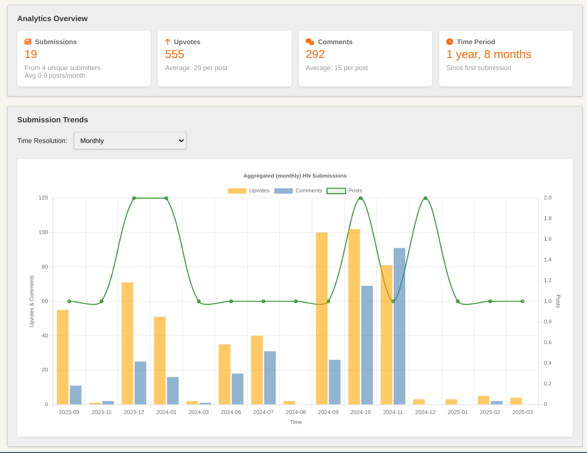

# HackerNews Domain Stats 📊

A web-based tool that analyzes and visualizes how domains perform on Hacker News over time. Get insights into submission patterns, engagement metrics, and the historical performance of any domain on HN.

## Features

- 📊 Key metrics: total submissions, unique submitters, upvotes, comments, engagement per post, and frequency over time
- 📈 Time-based visualizations (daily, weekly, monthly, yearly) for upvotes, comments with respect to submission count
- 🔍 Full submission history with links to original [^original] Hacker News discussions

[^original]: By default, the Algolia API does not match exact base URLs. For example, searching for `example.com` will also return results for domains matching `*example.com`.

## Tech Stack

* Vanilla JavaScript
* Chart.js for visualizations
* Lodash for data manipulation
* HN Algolia API for data fetching
* Font Awesome for icons

## License

MIT License — feel free to use and modify as needed!
